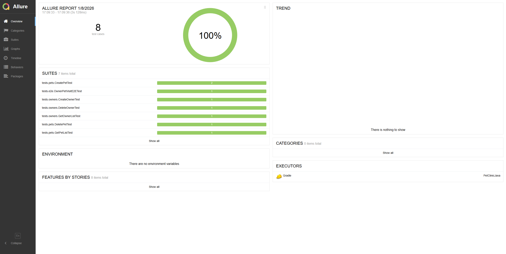
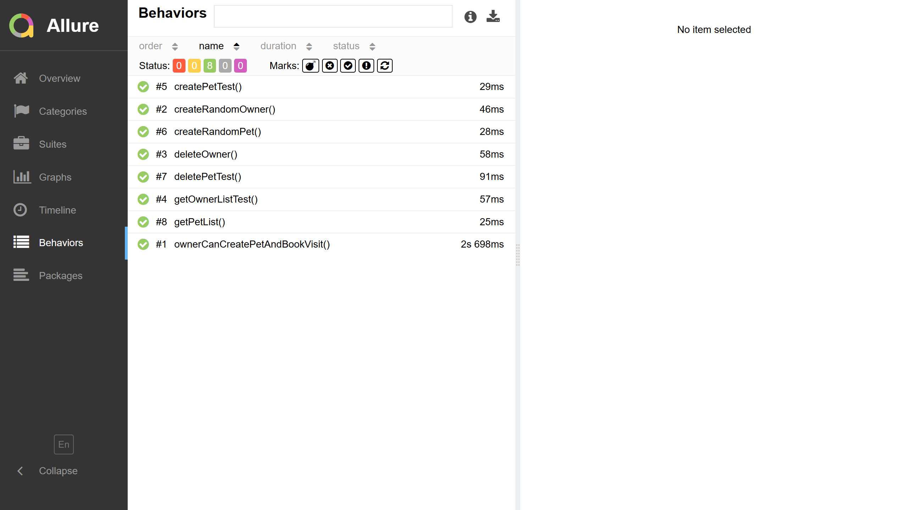
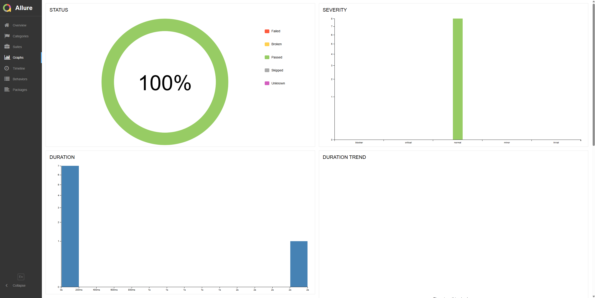

# PetClinic REST API Testing

Проект содержит автоматизированные тесты для **Spring PetClinic REST API**.
API основан на официальном репозитории: [spring-petclinic-rest](https://github.com/spring-petclinic/spring-petclinic-rest).

---

## Содержание

* <a href="#annotation">Описание</a>
* <a href="#tools">Инструменты</a>
* <a href="#locallyapi">Поднятие API локально</a>
* <a href="#projectstructure">Структура проекта</a>
* <a href="#runtests">Запуск тестов</a>
* <a href="#allure">Отчеты в Allure</a>
* <a href="#telegram">Уведомления в Telegram с использованием бота</a>
* <a href="#apiexamples">Примеры эндпоинтов API и запросов</a>
* <a href="#e2esc">E2E сценарий</a>

---

<a id="annotation"></a>
## Описание
Тестовый проект состоит из API-тестов.
Содержание проекта:
- [x] `POJO` проектирование
- [x] Возможность локального запуска тестов
- [x] Использование `Faker` для генерации данных
- [x] Использование `Lombok` для моделей в API тестах
- [x] Использование request/response спецификаций для API тестов
- [x] Автотесты оформлены как тестовая документация посредством аннотаций `Allure`

Spring PetClinic — демонстрационное приложение для управления клиникой для питомцев.  
Тесты покрывают все ключевые сущности приложения:

* **Owners** — владельцы животных
* **Pets** — питомцы
* **Pet Types** — типы животных
* **Visits** — визиты к врачу
* **Vets** — врачи
* **Specialties** — специализации врачей

---

<a id="tools"></a>
## Технологии и инструменты
В этом проекте реализованы тесты для **REST API** с использованием:

<div style="display: flex; flex-wrap: wrap; gap: 16px; align-items: center; justify-content: center; margin: 16px 0;">
  <a href="https://www.jetbrains.com/idea/"></a>
  <a href="https://github.com/"></a>
  <a href="https://www.java.com/"></a>
  <a href="https://gradle.org/"></a>
  <a href="https://junit.org/junit5/"></a>
  <a href="https://rest-assured.io/"></a>
  <a href="https://https://www.docker.com/"></a>
  <a href="https://github.com/allure-framework/"></a>
  <a href="https://telegram.org/"></a>
</div>

Автотесты в этом проекте написаны на Java с использованием библиотеки [Rest Assured](https://rest-assured.io/).

---

<a id="locallyapi"></a>
## Поднятие API локально

Для запуска тестов необходимо, чтобы API работал локально.
Самый простой способ — через Docker:

```bash
docker run -p 9966:9966 springcommunity/spring-petclinic-rest
```

После запуска API будет доступен по адресу:

```
http://localhost:9966/petclinic/api
```

---

<a id="projectstructure"></a>
## Структура проекта

```
src/test/java/
 ├── assertions      # Методы для валидации ответов API
 ├── base            # Общие настройки для тестов
 ├── dto             # Модели запросов и ответов (Request/Response)
 ├── helpers         # Вспомогательные утилиты (папка пуста)
 ├── specs           # Спецификации запросов и проверок для каждой сущности
 └── tests            # Тестовые сценарии
      ├── e2e        # End-to-End тесты
      ├── owners     # CRUD тесты для Owners
      └── pets       # CRUD тесты для Pets
```

---

<a id="runtests"></a>
## Запуск тестов

Тесты можно запускать через Gradle:

```bash
gradle clean test
gradle clean e2e
gradle clean owner
gradle clean pet
```

Или через IDE (IntelliJ IDEA, Eclipse):

* Открой нужный тестовый класс
* Правый клик → **Run**

---

<a id="allure"></a>
## Отчеты в <a target="_blank" href="https://jenkins.autotests.cloud/job/AutomationExerciseJava/"> Allure report </a> 

Allure-отчет включает в себя:

- **Статус тестов**: пройдено, провалено, пропущено.  
- **Интерактивную инфографику**: диаграмму по выполнению тестов, распределение по тегам, процент прохождения.  
- **Детализированные шаги выполнения тестов**: последовательность действий и проверок.  
- **Вспомогательные артефакты**:
  - Скриншоты страниц в момент завершения автотеста  
  - Page Source  
  - Логи браузерной консоли  
  - Видео выполнения автотеста

### Основное окно

<p align="center">

</p>

### Тесты

<p align="center">

</p>

### Графики

<p align="center">

</p>

<a id="telegram"></a>
## Уведомления в Telegram с использованием бота

<p>

</p>

---

<a id="apiexamples"></a>
## Примеры эндпоинтов API и запросов

### Owners

**GET /owners** — получить список владельцев

```bash
GET http://localhost:9966/petclinic/api/owners
```

**POST /owners** — создать нового владельца

```bash
POST http://localhost:9966/petclinic/api/owners
{
  "firstName": "Jane",
  "lastName": "Smith",
  "address": "456 Avenue",
  "city": "Los Angeles",
  "telephone": "0987654321"
}
```

### Pets

**GET /pets** — список питомцев

```bash
GET http://localhost:9966/petclinic/api/pets
```

**POST /pets** — добавить питомца

```bash
POST http://localhost:9966/petclinic/api/pets
{
  "name": "Buddy",
  "birthDate": "2020-01-01",
  "type": { "id": 1 }
}
```

### Pet Types

**GET /pettypes** — список типов животных

```bash
GET http://localhost:9966/petclinic/api/pettypes
```

**POST /pettypes** — добавить новый тип

```bash
POST http://localhost:9966/petclinic/api/pettypes
{
  "name": "Dog"
}
```

### Visits

**POST /visits** — добавить визит

```bash
POST http://localhost:9966/petclinic/api/visits
{
  "petId": 1,
  "date": "2026-01-08",
  "description": "Annual checkup"
}
```

### Vets

**GET /vets** — список врачей

```bash
GET http://localhost:9966/petclinic/api/vets
```

### Specialties

**GET /specialties** — список специализаций

```bash
GET http://localhost:9966/petclinic/api/specialties
```

**POST /specialties** — добавить новую специализацию

```bash
POST http://localhost:9966/petclinic/api/specialties
{
  "name": "surgery"
}
```

---

<a id="e2esc"></a>
## E2E сценарий

Пример полного пользовательского сценария, покрытого тестом `OwnerPetVisitE2ETest.java`:

1. Создание нового владельца (`POST /owners`)
2. Добавление питомца к владельцу (`POST /pets`)
3. Создание визита для питомца (`POST /visits`)
4. Проверка, что все данные корректно сохранились (`GET /owners/{id}` и `GET /pets/{id}`)

---

## Контакты

📧 [solovev02@ya.ru](mailto:solovev02@ya.ru)
💬 @mikeysoll
